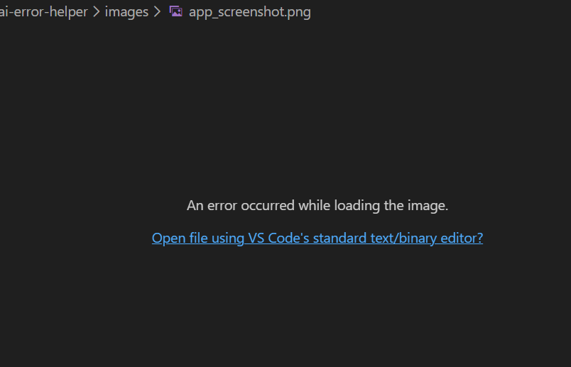

🤖 AI Error Helper
Stop Googling Errors. Let AI Understand Them.

For most people AI means Artificial Intelligence.
For me, AI also means Aditya’s Intelligence.

This project reflects my curiosity about how intelligent systems can assist developers in solving everyday programming problems. Instead of manually searching through forums and documentation, I wanted to explore how AI could understand programming errors and suggest solutions instantly.

🧑‍💻 The Problem

Every developer has experienced this moment.

You write some code.
You run it confidently.

Then the terminal responds with something like:

IndexError: list index out of range

You stare at it.

You search it on Google.

You open 10 StackOverflow tabs.

And finally… you realize the mistake was tiny.

Maybe an index.
Maybe a missing module.
Maybe a simple syntax error.

This project was built to explore a simple idea:

What if an AI system could instantly understand your error and suggest the most relevant solution?

💡 The Idea

AI Error Helper is a small semantic search tool that helps developers find solutions to programming errors.

Instead of matching exact keywords, the system understands the meaning of the error using vector embeddings.

So even if the user writes:

python list index problem

The system can still identify:

IndexError: list index out of range

and return the correct solution.

⚙️ How It Works

The system works in three main steps.

1️⃣ Error Knowledge Base

A dataset of 100+ common programming errors and their solutions is stored.

Example entry:

ZeroDivisionError: division by zero | Solution: Check the denominator before dividing.
2️⃣ Convert Errors Into Vectors

Each error is transformed into an embedding using Sentence Transformers.

These embeddings represent the meaning of the error.

3️⃣ Semantic Similarity Search

When the user enters an error like:

cannot divide by zero python

The system compares the query embedding with all stored embeddings.

The closest match is returned instantly.

🖥 Example Interaction
Input
cannot find module pandas
Output
Error:
ModuleNotFoundError: no module named pandas

Solution:
Install pandas using pip install pandas
📸 Project Screenshot

Record a 10-second screen recording showing:

1️⃣ Entering an error
2️⃣ Clicking search
3️⃣ Solution appearing

🏗 Tech Stack
Backend

Python

Flask

AI / Semantic Search

Sentence Transformers

NumPy

Frontend

HTML

CSS

📂 Project Structure
ai-error-helper
│
├── dataset
│   └── errors.txt
│
├── templates
│   └── index.html
│
├── images
│   └── Screenshot 2026-03-13 132954.png
│
├── ingest.py
├── app.py
├── requirements.txt
└── vectors.npy
🚀 Running the Project
1️⃣ Install Dependencies
pip install -r requirements.txt
2️⃣ Generate Embeddings
python ingest.py

This converts all error entries into vector embeddings.

3️⃣ Start the Server
python app.py
4️⃣ Open the Application
http://127.0.0.1:5000

Paste a programming error and the AI will suggest a solution.

🎯 Project Context

This project explores how vector embeddings and semantic search can be used to build intelligent developer tools.

The idea aligns with technologies developed by Endee, which focuses on building AI-powered systems using vector databases and semantic search.

🔮 Future Improvements

Possible next steps:

Larger dataset of programming errors

Show top 3 similar solutions

StackOverflow answer integration

LLM explanation for beginners

Chat-style debugging interface

👨‍💻 Author

Aditya Gautam